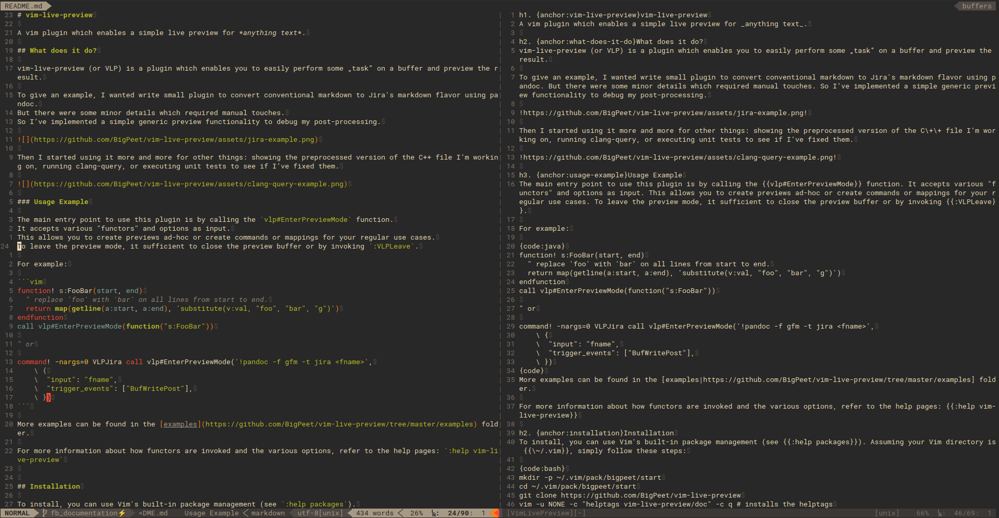
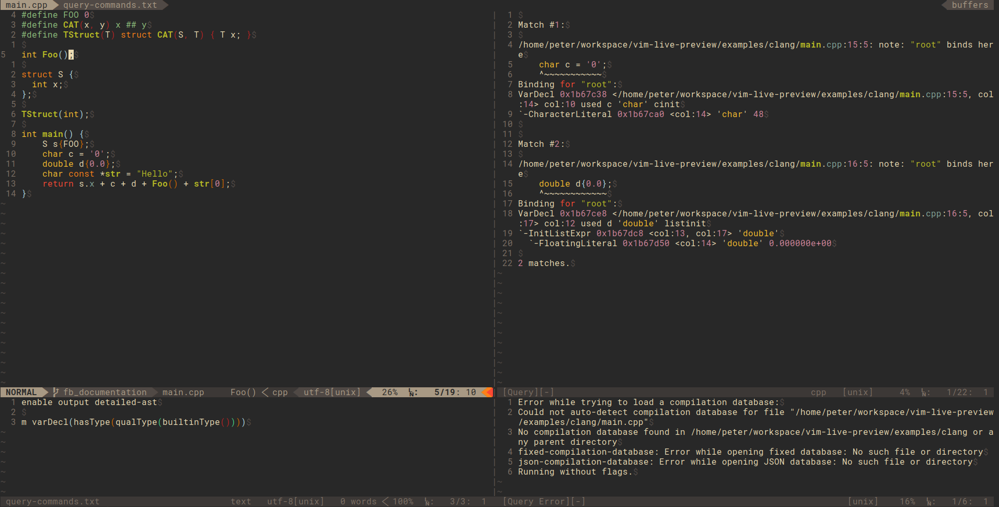

# vim-live-preview

A vim plugin which enables a simple live preview for *anything text*.

## What does it do?

vim-live-preview (or VLP) is a plugin which enables you to easily perform some „task“ on a buffer and preview the result.

To give an example, I wanted write small plugin to convert conventional markdown to Jira's markdown flavor using pandoc.
But there were some minor details which required manual touches.
So I‘ve implemented a simple generic preview functionality to debug my post-processing.



Then I started using it more and more for other things: showing the preprocessed version of the C++ file I’m working on, running clang-query, or executing unit tests to see if I’ve fixed them.



### Usage Example

The main entry point to use this plugin is by calling the `vlp#EnterPreviewMode` function.
It accepts various "functors" and options as input.
This allows you to create previews ad-hoc or create commands or mappings for your regular use cases.
To leave the preview mode, it sufficient to close the preview buffer or by invoking `:VLPLeave`.

For example:

```vim
function! s:FooBar(start, end)
  " replace 'foo' with 'bar' on all lines from start to end.
  return map(getline(a:start, a:end), 'substitute(v:val, "foo", "bar", "g")')
endfunction
call vlp#EnterPreviewMode(function("s:FooBar"))

" or

command! -nargs=0 VLPJira call vlp#EnterPreviewMode('!pandoc -f gfm -t jira <fname>',
    \ {
    \  "input": "fname",
    \  "trigger_events": ["BufWritePost"],
    \ })
```

More examples can be found in the [examples](https://github.com/BigPeet/vim-live-preview/tree/master/examples) folder.

For more information about how functors are invoked and the various options, refer to the help pages: `:help vim-live-preview`

## Installation

To install, you can use Vim's built-in package management (see `:help packages`).
Assuming your Vim directory is `~/.vim`, simply follow these steps:

```bash
mkdir -p ~/.vim/pack/bigpeet/start
cd ~/.vim/pack/bigpeet/start
git clone https://github.com/BigPeet/vim-live-preview
vim -u NONE -c "helptags vim-live-preview/doc" -c q # installs the helptags
```

Alternatively, use your preferred 3rd-party plugin manager, e.g. [pathogen](https://github.com/tpope/vim-pathogen) or [Vundle](https://github.com/VundleVim/Vundle.vim).

## Options

Options can be either set globally or individually for each call.
For each option, the global option's name is prefixed with `g:vlp_*`.
E.g., the option `preview_buffer_name` can be globally set with `g:vlp_preview_buffer_name`.
If not specified, the default value will be used.
The priority is: individiual setting > global setting > default value

To demonstrate:

```vim
" will use the default value for 'preview_buffer_name': [VimLivePreview]
call vlp#EnterPreviewMode(function("s:FooBar"))
```

```vim
let g:vlp_preview_buffer_name = "[MyPreview]"
" will use the global value for 'preview_buffer_name': [MyPreview]
call vlp#EnterPreviewMode(function("s:FooBar"))
```

```vim
let g:vlp_preview_buffer_name = "[MyPreview]"
" will use the specified value for 'preview_buffer_name': [FooBarPreview]
call vlp#EnterPreviewMode(function("s:FooBar"), {"preview_buffer_name": "[FooBarPreview]"})
```

An exhaustive list of all options and their defaults can be found in the help pages: `:help vlp-options`
